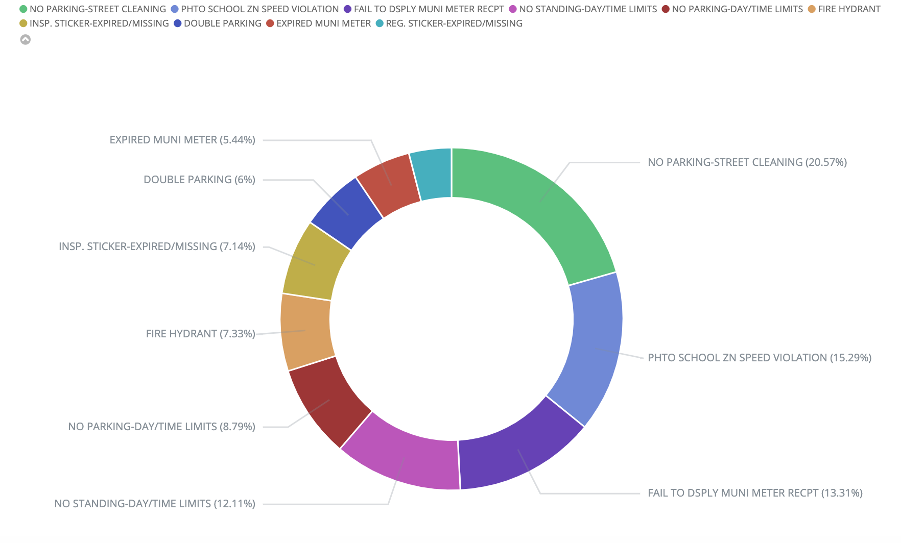
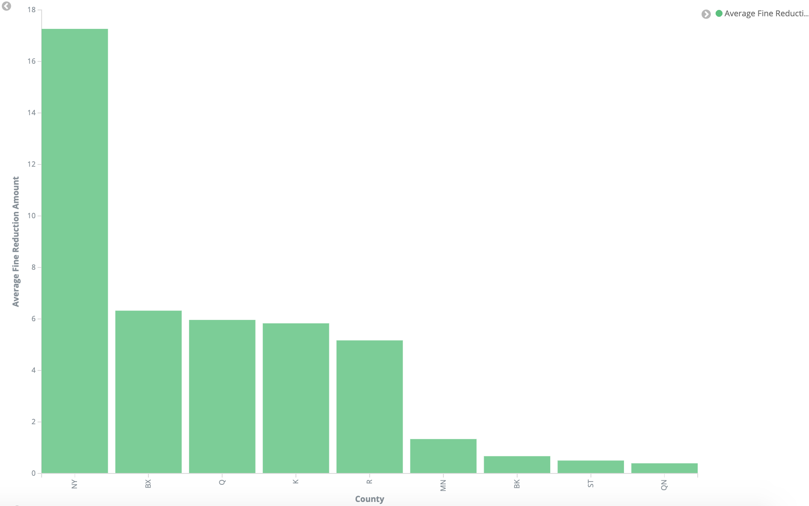
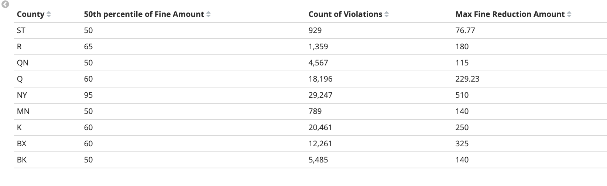
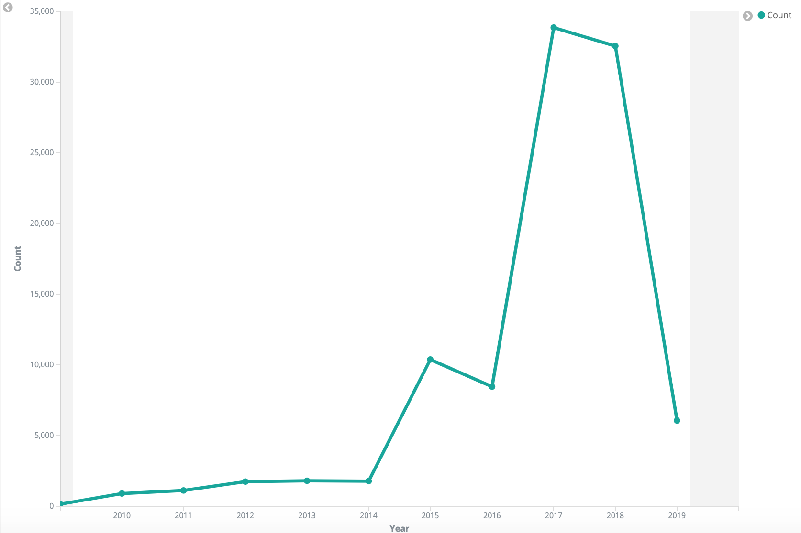

# Using NYC Open Parking and Camera Violations API

## Requirements

This project uses NYC Parking Violations data from [NYC Open Data.](https://opendata.cityofnewyork.us/)
The data is pulled from [Open Parking and Camera Violations](https://dev.socrata.com/foundry/data.cityofnewyork.us/nc67-uf89) (OPCV) API, which is made available via 
[Socrata Open Data API](https://dev.socrata.com/). The [app_token](https://data.cityofnewyork.us/login) is necessary to access NYC Open Data APIs.

## Docker Image for Accessing the API

The docker image for retrieving data from OPCV API can be pulled from [this dockerhub profile](https://hub.docker.com/u/asyakhleborodova). The following command line can be used to access OPCV API data.

## Using the API 

$ docker run -e APP_KEY=YOUR_APP_TOKEN -t nyc_parking_violations:1.0 python -m main --page_size=1000 --page_num=4 --output=results.json

--page_size: This is a required command line argument that specified the number of results per page.

--page_num: This argument is optional, if not provided the API will return all of the
available content. 

--output: This argument is optional, if not included results will be printed to stdout. 

# Loading NYC Open Parking and Camera Violations API Results into Elasticsearch Using Docker-Compose

## Loading Data into Elastic Search

The docker-compose.yml file was used here for three docker containers. The main.py was altered to load data into elasticsearch. 

$ docker-compose run -e APP_KEY=YOUR_APP_TOKEN pyth python -m main --page_size=100 --page_num=1000

$ docker-compose run -e APP_KEY=YOUR_APP_TOKEN pyth python -m main --page_size=100 --page_num=1000 --output=results.json

100,000 of 48 million rows of data were loaded into elasticsearch, the data can then be further processed in Kibana dev tools.

## Kibana Visualizations

The following images were created in Kibana using the 100,000 rows that were loaded into the elasticsearch. 

Ten most popular parking violations.

The average fine reduction amount by county.

The below table contains county data for median fine amount, count of parking violations, and maximum fine reduction.

Parking violations per year for a 10 year period. 

